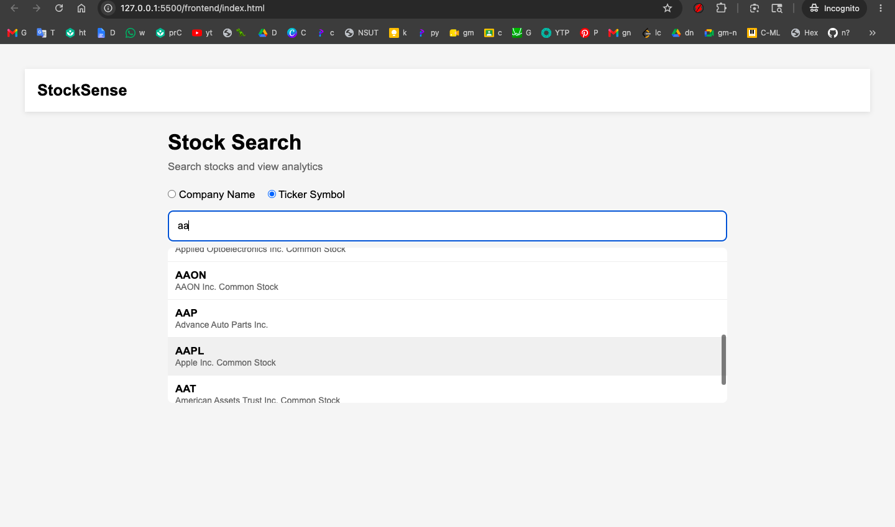
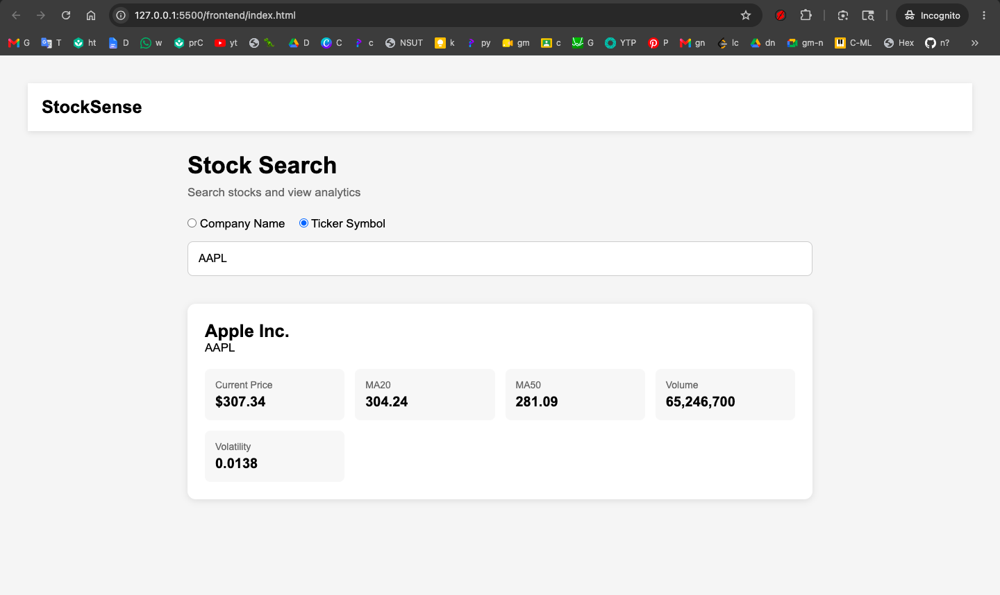

# StockSense 📈

StockSense is a stock analytics platform built during the Open Source Hackathon 2026. It allows users to search publicly traded companies, retrieve live stock market data, and view key technical indicators generated using Python and financial data from Yahoo Finance.

The project combines a Node.js backend, a Python analytics engine, and a simple web frontend to provide an accessible stock research experience.

---

## Features

### Stock Search

* Search by company name
* Search by ticker symbol
* Fast filtering using a local stock database
* Alphabetically sorted search results

### Market Analytics

* Live stock data retrieval
* Current stock price
* Trading volume
* 20-Day Moving Average (MA20)
* 50-Day Moving Average (MA50)
* Historical volatility calculation

### Technical Analysis

* Moving average calculations
* Daily return calculations
* Volatility measurement
* Extensible analytics architecture for future indicators

---

## Tech Stack

### Frontend

* HTML5
* CSS3
* JavaScript

### Backend

* Node.js
* Express.js

### Data & Analytics

* Python
* Pandas
* NumPy
* yFinance

### Development Tools

* Git
* GitHub

---

## Project Structure

```text
stock-market-project/
│
├── backend/
│   ├── data/
│   │   └── stocks.json
│   │
│   ├── routes/
│   │   ├── search.js
│   │   └── stock.js
│   │
│   └── server.js
│
├── frontend/
│   ├── index.html
│   ├── style.css
│   └── app.js
│
├── python/
│   ├── stock_data.py
│   ├── indicators.py
│   └── analyze.py
│
├── package.json
├── package-lock.json
├── LICENSE
└── README.md
```

---

## Installation

### 1. Clone Repository

```bash
git clone https://github.com/samaira173/stock-market-project.git

cd stock-market-project
```

---

### 2. Install Node.js Dependencies

```bash
npm install
```

---

### 3. Create Python Environment

Windows:

```bash
py -m venv venv

venv\Scripts\activate
```

Mac/Linux:

```bash
python3 -m venv venv

source venv/bin/activate
```

---

### 4. Install Python Dependencies

```bash
pip install pandas numpy matplotlib scikit-learn yfinance
```

---

### 5. Start Backend Server

```bash
node backend/server.js
```

Server runs on:

```text
http://localhost:3000
```

---

### 6. Open Frontend

Open:

```text
frontend/index.html
```

in your browser.

---

## Screenshots

### Search Interface



### Stock Analytics Dashboard



---

## How It Works

1. User searches for a company name or ticker symbol.
2. Node.js backend filters stock data from the local database.
3. User selects a stock.
4. Backend calls the Python analytics engine.
5. Python retrieves market data using Yahoo Finance.
6. Technical indicators are calculated.
7. Results are returned as JSON and displayed in the frontend.

---

## Motivation

StockSense was built to explore the integration of web development and financial analytics. The goal was to create a lightweight platform that demonstrates how Python-based stock analysis can be connected to a modern web application.

---

## Future Roadmap

* Interactive stock charts
* Watchlists
* Portfolio tracking
* User authentication
* AI-powered stock insights
* Machine learning trend prediction
* News sentiment analysis
* Market comparison tools
* Export analytics reports

---

## License

This project is licensed under the MIT License.

---

## Author

**Samaira**

GitHub: https://github.com/sam173

Built during the Open Source Hackathon 2026 🚀
